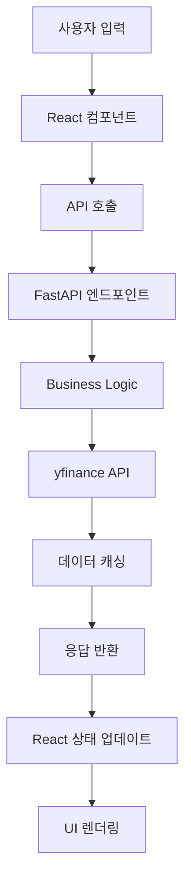

# 01. 프로젝트 구조 및 아키텍처 설계

## 📁 프로젝트 구조

```
stock/
├── frontend/                 # React 프론트엔드
│   ├── public/
│   ├── src/
│   │   ├── components/      # 재사용 가능한 컴포넌트
│   │   ├── pages/          # 페이지 컴포넌트
│   │   ├── hooks/          # 커스텀 훅
│   │   ├── services/       # API 호출 서비스
│   │   ├── utils/          # 유틸리티 함수
│   │   ├── types/          # TypeScript 타입 정의
│   │   └── styles/         # 스타일 파일
│   ├── package.json
│   └── tailwind.config.js
├── backend/                 # FastAPI 백엔드
│   ├── app/
│   │   ├── api/            # API 라우터
│   │   ├── models/         # 데이터 모델
│   │   ├── services/       # 비즈니스 로직
│   │   ├── utils/          # 유틸리티 함수
│   │   └── main.py         # FastAPI 앱 진입점
│   ├── tests/              # 테스트 파일
│   ├── requirements.txt
│   └── Dockerfile
├── docs/                   # 프로젝트 문서
├── .github/                # GitHub Actions
│   └── workflows/
├── docker-compose.yml      # 개발 환경 설정
└── README.md
```

## 🏗 아키텍처 설계

### Clean Architecture 적용

```
┌─────────────────────────────────────────────────────────────┐
│                    Presentation Layer                       │
│  ┌─────────────────┐  ┌─────────────────┐  ┌─────────────┐ │
│  │   React App     │  │   Mobile UI     │  │   Charts    │ │
│  └─────────────────┘  └─────────────────┘  └─────────────┘ │
└─────────────────────────────────────────────────────────────┘
┌─────────────────────────────────────────────────────────────┐
│                     API Layer                              │
│  ┌─────────────────┐  ┌─────────────────┐  ┌─────────────┐ │
│  │   FastAPI       │  │   CORS          │  │   Auth      │ │
│  └─────────────────┘  └─────────────────┘  └─────────────┘ │
└─────────────────────────────────────────────────────────────┘
┌─────────────────────────────────────────────────────────────┐
│                   Business Logic Layer                      │
│  ┌─────────────────┐  ┌─────────────────┐  ┌─────────────┐ │
│  │ Stock Service   │  │ Chart Service   │  │ Data Cache  │ │
│  └─────────────────┘  └─────────────────┘  └─────────────┘ │
└─────────────────────────────────────────────────────────────┘
┌─────────────────────────────────────────────────────────────┐
│                    Data Access Layer                        │
│  ┌─────────────────┐  ┌─────────────────┐  ┌─────────────┐ │
│  │   yfinance      │  │   SQLite DB     │  │   Redis     │ │
│  └─────────────────┘  └─────────────────┘  └─────────────┘ │
└─────────────────────────────────────────────────────────────┘
```

## 🔧 기술 스택 상세

### Frontend
- **React 18**: 최신 React 기능 활용 (Suspense, Concurrent Features)
- **TypeScript**: 타입 안정성 확보
- **Tailwind CSS**: 반응형 디자인 및 모바일 최적화
- **Recharts**: 다양한 차트 시각화
- **Axios**: HTTP 클라이언트
- **React Query**: 서버 상태 관리 및 캐싱
- **React Router**: SPA 라우팅

### Backend
- **FastAPI**: 고성능 Python 웹 프레임워크
- **yfinance**: Yahoo Finance 데이터 수집
- **SQLAlchemy**: ORM
- **Pydantic**: 데이터 검증
- **Redis**: 캐싱 및 세션 관리
- **Uvicorn**: ASGI 서버

### DevOps
- **GitHub Actions**: CI/CD 파이프라인
- **Docker**: 컨테이너화
- **Vercel**: 프론트엔드 배포
- **Render/Fly.io**: 백엔드 배포

## 📱 모바일 최적화 전략

### 반응형 디자인
- Tailwind CSS의 반응형 클래스 활용
- 모바일 퍼스트 접근법
- 터치 친화적 UI 요소

### 성능 최적화
- 이미지 최적화 및 lazy loading
- 코드 스플리팅
- 서비스 워커를 통한 캐싱

### 사용자 경험
- 스와이프 제스처 지원
- 모바일 네비게이션 패턴
- 터치 타겟 크기 최적화 (44px 이상)

## 🔄 데이터 플로우



## 🧪 테스트 전략

### Frontend 테스트
- **Jest**: 단위 테스트
- **React Testing Library**: 컴포넌트 테스트
- **Cypress**: E2E 테스트

### Backend 테스트
- **pytest**: 단위 테스트
- **pytest-asyncio**: 비동기 테스트
- **httpx**: API 테스트

### 테스트 커버리지 목표
- 단위 테스트: 80% 이상
- 통합 테스트: 주요 기능 100%
- E2E 테스트: 핵심 사용자 플로우 