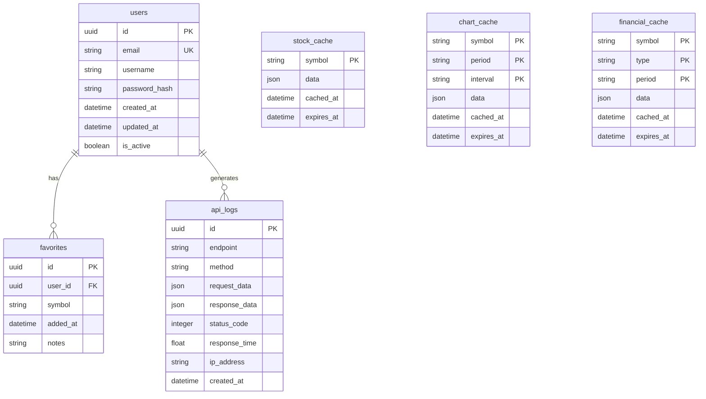

# 03. 데이터베이스 설계 및 모델 정의

## 🗄 데이터베이스 아키텍처

### 기술 스택
- **Primary DB**: SQLite (개발/테스트), PostgreSQL (프로덕션)
- **Cache**: Redis (세션 및 임시 데이터)
- **ORM**: SQLAlchemy 2.0
- **Migration**: Alembic

### 데이터베이스 선택 이유
- **SQLite**: 개발 환경에서 빠른 설정 및 테스트
- **PostgreSQL**: 프로덕션에서 고성능 및 확장성
- **Redis**: 빠른 캐싱 및 세션 관리

## 📊 ERD (Entity Relationship Diagram)



## 🏗 테이블 설계

### 1. Users 테이블
```sql
CREATE TABLE users (
    id UUID PRIMARY KEY DEFAULT gen_random_uuid(),
    email VARCHAR(255) UNIQUE NOT NULL,
    username VARCHAR(100) UNIQUE NOT NULL,
    password_hash VARCHAR(255) NOT NULL,
    created_at TIMESTAMP WITH TIME ZONE DEFAULT CURRENT_TIMESTAMP,
    updated_at TIMESTAMP WITH TIME ZONE DEFAULT CURRENT_TIMESTAMP,
    is_active BOOLEAN DEFAULT TRUE,
    last_login TIMESTAMP WITH TIME ZONE,
    preferences JSONB DEFAULT '{}'
);

-- 인덱스
CREATE INDEX idx_users_email ON users(email);
CREATE INDEX idx_users_username ON users(username);
CREATE INDEX idx_users_created_at ON users(created_at);
```

### 2. Favorites 테이블
```sql
CREATE TABLE favorites (
    id UUID PRIMARY KEY DEFAULT gen_random_uuid(),
    user_id UUID NOT NULL REFERENCES users(id) ON DELETE CASCADE,
    symbol VARCHAR(20) NOT NULL,
    added_at TIMESTAMP WITH TIME ZONE DEFAULT CURRENT_TIMESTAMP,
    notes TEXT,
    display_order INTEGER DEFAULT 0,
    
    -- 복합 유니크 제약조건
    UNIQUE(user_id, symbol)
);

-- 인덱스
CREATE INDEX idx_favorites_user_id ON favorites(user_id);
CREATE INDEX idx_favorites_symbol ON favorites(symbol);
CREATE INDEX idx_favorites_added_at ON favorites(added_at);
```

### 3. Stock Cache 테이블
```sql
CREATE TABLE stock_cache (
    symbol VARCHAR(20) PRIMARY KEY,
    data JSONB NOT NULL,
    cached_at TIMESTAMP WITH TIME ZONE DEFAULT CURRENT_TIMESTAMP,
    expires_at TIMESTAMP WITH TIME ZONE NOT NULL,
    version INTEGER DEFAULT 1
);

-- 인덱스
CREATE INDEX idx_stock_cache_expires_at ON stock_cache(expires_at);
CREATE INDEX idx_stock_cache_cached_at ON stock_cache(cached_at);
```

### 4. Chart Cache 테이블
```sql
CREATE TABLE chart_cache (
    symbol VARCHAR(20) NOT NULL,
    period VARCHAR(10) NOT NULL,
    interval VARCHAR(10) NOT NULL,
    data JSONB NOT NULL,
    cached_at TIMESTAMP WITH TIME ZONE DEFAULT CURRENT_TIMESTAMP,
    expires_at TIMESTAMP WITH TIME ZONE NOT NULL,
    
    PRIMARY KEY (symbol, period, interval)
);

-- 인덱스
CREATE INDEX idx_chart_cache_expires_at ON chart_cache(expires_at);
CREATE INDEX idx_chart_cache_symbol ON chart_cache(symbol);
```

### 5. Financial Cache 테이블
```sql
CREATE TABLE financial_cache (
    symbol VARCHAR(20) NOT NULL,
    type VARCHAR(20) NOT NULL, -- 'income', 'balance', 'cashflow'
    period VARCHAR(10) NOT NULL, -- 'annual', 'quarterly'
    data JSONB NOT NULL,
    cached_at TIMESTAMP WITH TIME ZONE DEFAULT CURRENT_TIMESTAMP,
    expires_at TIMESTAMP WITH TIME ZONE NOT NULL,
    
    PRIMARY KEY (symbol, type, period)
);

-- 인덱스
CREATE INDEX idx_financial_cache_expires_at ON financial_cache(expires_at);
CREATE INDEX idx_financial_cache_symbol ON financial_cache(symbol);
```

### 6. API Logs 테이블
```sql
CREATE TABLE api_logs (
    id UUID PRIMARY KEY DEFAULT gen_random_uuid(),
    user_id UUID REFERENCES users(id) ON DELETE SET NULL,
    endpoint VARCHAR(255) NOT NULL,
    method VARCHAR(10) NOT NULL,
    request_data JSONB,
    response_data JSONB,
    status_code INTEGER NOT NULL,
    response_time FLOAT NOT NULL, -- milliseconds
    ip_address INET,
    user_agent TEXT,
    created_at TIMESTAMP WITH TIME ZONE DEFAULT CURRENT_TIMESTAMP
);

-- 인덱스
CREATE INDEX idx_api_logs_user_id ON api_logs(user_id);
CREATE INDEX idx_api_logs_created_at ON api_logs(created_at);
CREATE INDEX idx_api_logs_endpoint ON api_logs(endpoint);
CREATE INDEX idx_api_logs_status_code ON api_logs(status_code);
```

## 🐍 SQLAlchemy 모델 정의

### Base Model
```python
from sqlalchemy.ext.declarative import declarative_base
from sqlalchemy import Column, DateTime, func
from sqlalchemy.dialects.postgresql import UUID
import uuid

Base = declarative_base()

class BaseModel(Base):
    __abstract__ = True
    
    created_at = Column(DateTime(timezone=True), server_default=func.now())
    updated_at = Column(DateTime(timezone=True), server_default=func.now(), onupdate=func.now())
```

### User Model
```python
from sqlalchemy import Column, String, Boolean, JSON
from sqlalchemy.dialects.postgresql import UUID
from sqlalchemy.orm import relationship

class User(BaseModel):
    __tablename__ = "users"
    
    id = Column(UUID(as_uuid=True), primary_key=True, default=uuid.uuid4)
    email = Column(String(255), unique=True, nullable=False, index=True)
    username = Column(String(100), unique=True, nullable=False, index=True)
    password_hash = Column(String(255), nullable=False)
    is_active = Column(Boolean, default=True)
    last_login = Column(DateTime(timezone=True))
    preferences = Column(JSON, default={})
    
    # Relationships
    favorites = relationship("Favorite", back_populates="user", cascade="all, delete-orphan")
    api_logs = relationship("APILog", back_populates="user")
```

### Favorite Model
```python
from sqlalchemy import Column, String, Text, Integer, ForeignKey
from sqlalchemy.dialects.postgresql import UUID
from sqlalchemy.orm import relationship

class Favorite(BaseModel):
    __tablename__ = "favorites"
    
    id = Column(UUID(as_uuid=True), primary_key=True, default=uuid.uuid4)
    user_id = Column(UUID(as_uuid=True), ForeignKey("users.id"), nullable=False, index=True)
    symbol = Column(String(20), nullable=False, index=True)
    notes = Column(Text)
    display_order = Column(Integer, default=0)
    
    # Relationships
    user = relationship("User", back_populates="favorites")
    
    __table_args__ = (
        UniqueConstraint('user_id', 'symbol', name='uq_favorites_user_symbol'),
    )
```

### Cache Models
```python
from sqlalchemy import Column, String, JSON, DateTime
from sqlalchemy.dialects.postgresql import UUID

class StockCache(BaseModel):
    __tablename__ = "stock_cache"
    
    symbol = Column(String(20), primary_key=True)
    data = Column(JSON, nullable=False)
    expires_at = Column(DateTime(timezone=True), nullable=False, index=True)
    version = Column(Integer, default=1)

class ChartCache(BaseModel):
    __tablename__ = "chart_cache"
    
    symbol = Column(String(20), primary_key=True)
    period = Column(String(10), primary_key=True)
    interval = Column(String(10), primary_key=True)
    data = Column(JSON, nullable=False)
    expires_at = Column(DateTime(timezone=True), nullable=False, index=True)

class FinancialCache(BaseModel):
    __tablename__ = "financial_cache"
    
    symbol = Column(String(20), primary_key=True)
    type = Column(String(20), primary_key=True)
    period = Column(String(10), primary_key=True)
    data = Column(JSON, nullable=False)
    expires_at = Column(DateTime(timezone=True), nullable=False, index=True)
```

### API Log Model
```python
from sqlalchemy import Column, String, Integer, Float, Text, ForeignKey, JSON
from sqlalchemy.dialects.postgresql import UUID, INET
from sqlalchemy.orm import relationship

class APILog(BaseModel):
    __tablename__ = "api_logs"
    
    id = Column(UUID(as_uuid=True), primary_key=True, default=uuid.uuid4)
    user_id = Column(UUID(as_uuid=True), ForeignKey("users.id"), nullable=True, index=True)
    endpoint = Column(String(255), nullable=False, index=True)
    method = Column(String(10), nullable=False)
    request_data = Column(JSON)
    response_data = Column(JSON)
    status_code = Column(Integer, nullable=False, index=True)
    response_time = Column(Float, nullable=False)  # milliseconds
    ip_address = Column(INET)
    user_agent = Column(Text)
    
    # Relationships
    user = relationship("User", back_populates="api_logs")
```

## 🔄 캐싱 전략

### 캐시 TTL (Time To Live)
| 데이터 유형 | TTL | 이유 |
|------------|-----|------|
| 주식 기본 정보 | 15분 | 실시간 데이터 특성 |
| 차트 데이터 | 1시간 | 상대적으로 안정적 |
| 재무 정보 | 24시간 | 분기별 업데이트 |
| 배당 정보 | 12시간 | 월별 업데이트 |

### 캐시 무효화 전략
```python
class CacheManager:
    def invalidate_stock_cache(self, symbol: str):
        """주식 정보 캐시 무효화"""
        pass
    
    def invalidate_chart_cache(self, symbol: str, period: str = None):
        """차트 캐시 무효화"""
        pass
    
    def invalidate_financial_cache(self, symbol: str, type: str = None):
        """재무 정보 캐시 무효화"""
        pass
```

## 📈 성능 최적화

### 인덱스 전략
- **B-tree 인덱스**: 기본 키, 외래 키, 검색 조건
- **Partial 인덱스**: 활성 사용자, 만료되지 않은 캐시
- **Composite 인덱스**: 복합 검색 조건

### 쿼리 최적화
```sql
-- 자주 사용되는 쿼리 최적화
CREATE INDEX idx_favorites_user_symbol ON favorites(user_id, symbol);
CREATE INDEX idx_cache_expires_symbol ON stock_cache(expires_at, symbol);

-- Partial 인덱스
CREATE INDEX idx_active_users ON users(id) WHERE is_active = true;
CREATE INDEX idx_valid_cache ON stock_cache(symbol) WHERE expires_at > NOW();
```

### 데이터 파티셔닝 (향후 확장)
```sql
-- API 로그 테이블 파티셔닝 (월별)
CREATE TABLE api_logs_2024_01 PARTITION OF api_logs
FOR VALUES FROM ('2024-01-01') TO ('2024-02-01');
```

## 🔒 보안 고려사항

### 데이터 암호화
- **At Rest**: 데이터베이스 레벨 암호화
- **In Transit**: TLS/SSL 연결
- **Sensitive Data**: 사용자 비밀번호 해싱

### 접근 제어
```sql
-- 읽기 전용 사용자 생성
CREATE USER readonly_user WITH PASSWORD 'secure_password';
GRANT CONNECT ON DATABASE stock_dashboard TO readonly_user;
GRANT USAGE ON SCHEMA public TO readonly_user;
GRANT SELECT ON ALL TABLES IN SCHEMA public TO readonly_user;
```

## 🧪 테스트 데이터

### 개발용 시드 데이터
```python
def create_test_data():
    """개발용 테스트 데이터 생성"""
    test_users = [
        {
            "email": "test@example.com",
            "username": "testuser",
            "password_hash": "hashed_password"
        }
    ]
    
    test_favorites = [
        {
            "user_id": user_id,
            "symbol": "AAPL",
            "notes": "Apple Inc."
        },
        {
            "user_id": user_id,
            "symbol": "MSFT",
            "notes": "Microsoft Corporation"
        }
    ]
``` 